# 2025年十二大最佳AI视频生成平台

你想做营销视频,找摄影团队报价一开口就是几万块;需要培训教程,剪辑师排期要等两周。最头疼的是多语言版本,每个语言都得重拍重配,预算直接翻倍。其实现在有个更聪明的解决方案——AI视频生成工具。只需要输入文字脚本或上传一张照片,AI就能生成一个会说话会手势的数字人替你讲解,支持140多种语言配音,从构思到成片全程不超过10分钟。这类平台能帮你省掉摄像机、演员、剪辑师,用十分之一的成本和时间产出专业视频。这篇文章汇总了12个实战中最好用的AI视频生成器,覆盖营销广告、产品演示、教育培训、多语言本地化等各种场景。

## **[KreadoAI](https://www.kreadoai.com)**

1000+真人AI数字人和40000+AI语音,一分钟生成多语言营销视频。

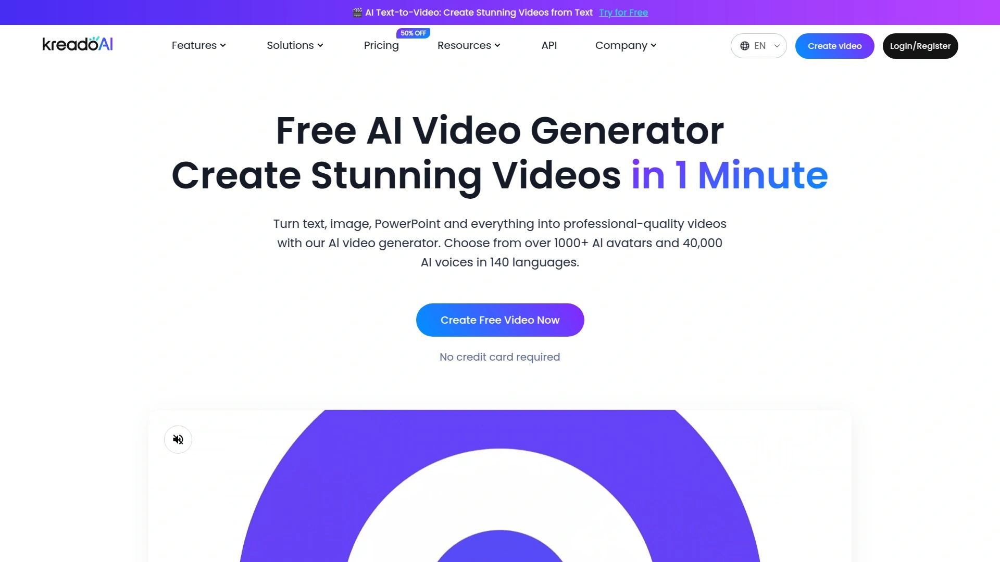

KreadoAI最大的优势是它的规模和速度。平台提供超过1000个基于真人形象的AI数字人,每个数字人都有精准的唇形同步和自然的手势动作。你可以从文字、图片、音频、PPT甚至网址链接直接生成视频,不需要任何拍摄设备或剪辑技能。支持140多种语言的40000多种AI语音,覆盖微软和ElevenLabs的TTS模型,声音质量非常接近真人。

特别实用的是它的多场景模板:TikTok营销视频、产品推广、教学培训、照片说话、PPT转视频等等。如果你想创建专属数字人,KreadoAI可以用你的照片或录像训练一个AI分身,之后用文字就能让它讲任何内容。还能克隆声音,保留原声的语调、口音和细微差别,准确率超过99%。平台已经服务超过200万用户,覆盖200多个国家。提供免费计划,包含3分钟视频创建和10分钟文字转语音,还有100多个免费数字人可用。

## **[HeyGen](https://www.heygen.com)**

2025年最逼真的AI数字人平台,照片秒变会说话的视频主角。

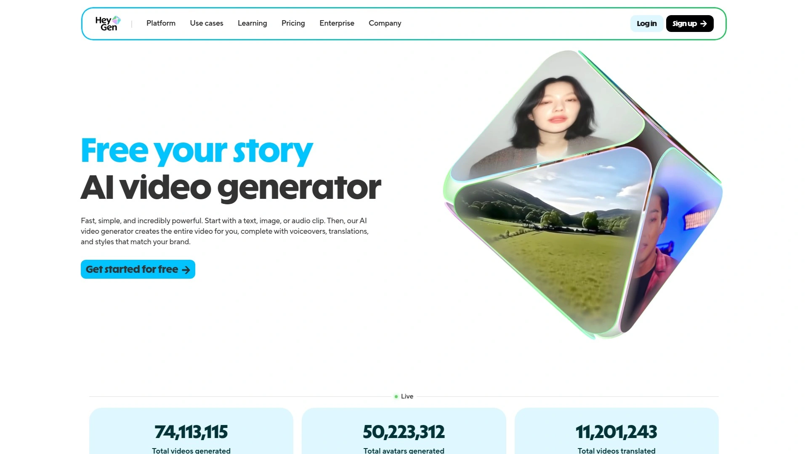

HeyGen的AI数字人技术在业内公认是最接近真人的。它最新的Avatar IV模型能把一张静态照片转化成完整视频,包括自然的语音同步、生动的面部表情和真实的手势动作。你可以选择1000多个现成的数字人,或者上传自己的照片、录制视频来创建专属AI分身。生成的视频支持多语言配音,可以用在YouTube、社交媒体、产品演示、培训教程等各种场景。

HeyGen的文字转视频功能特别强大,只需要输入脚本,AI会自动完成配音、视觉设计、剪辑,生成高清视频(1080p或4K)。你可以选择不同的语音风格、语言和数字人形象来匹配不同的受众。平台还支持音频转视频,上传或录制你的声音,选个数字人形象,HeyGen会自动同步唇形、表情和视觉元素。免费计划每月可创建3个视频,Creator计划每月29美元,团队计划每人每月39美元,企业版提供定制方案。

## **[Synthesia](https://www.synthesia.io)**

企业级AI视频平台,估值超10亿美元,5万家企业在用。

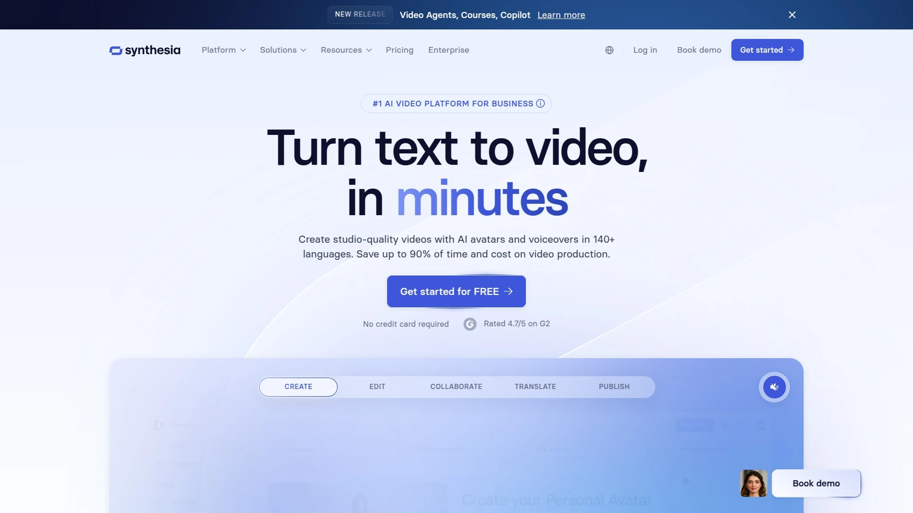

Synthesia是行业标杆级别的平台,特别受大型企业青睐。它提供150多个AI数字人和130多种语言的AI配音,能把枯燥的文字内容快速转化成专业视频,不需要麦克风、摄像机、演员或录音棚。平台已经帮助客户节省了数千万美元的传统视频制作成本,还能轻松制作多语言版本。

Synthesia的一体化编辑器功能完善,包括AI脚本助手、视频动画工具、自动生成字幕、65种以上的视频模板。你可以添加图片、视频、背景音乐、形状、转场效果,全程不需要专业剪辑经验。支持文字转视频编辑,能创建130多种语言的讲解视频。特别适合制作培训视频、营销内容、客户服务视频等商业应用。虽然是付费服务,但考虑到它能节省的传统视频制作成本,投资回报率很高。

## **[D-ID](https://www.d-id.com)**

照片转视频的先驱者,一张图片就能生成会说话的数字人。

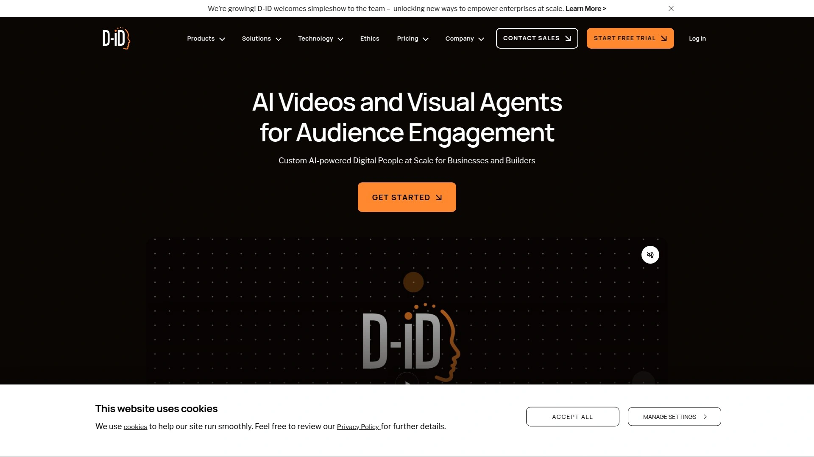

D-ID的Creative Reality Studio能把任何静态照片或视频转化成会说话、有表情的数字人。你可以上传自己的照片,或从平台的人物库中选择真实感或插画风格的形象。支持120种语言,可以让你的数字人对全球受众讲话。操作特别简单,选择或上传照片,输入要说的文字或上传音频,点击生成就能得到MP4视频。

D-ID特别适合创建个性化内容,比如会说话的收藏品、互动游戏中的角色、增强版演示文稿、或者给聊天机器人加上视觉形象。它的AI调节功能可以让你自定义数字人的声音,可以上传录音或使用文字转语音来决定数字人说什么。移动端应用支持随时随地创作,让创意不受地点限制。D-ID承诺保护用户数据,使用先进的数据加密,严格执行内容指南。

## **[Fliki](https://fliki.ai)**

从文字到视频只需4步,2000多种逼真AI语音和角色一致性。

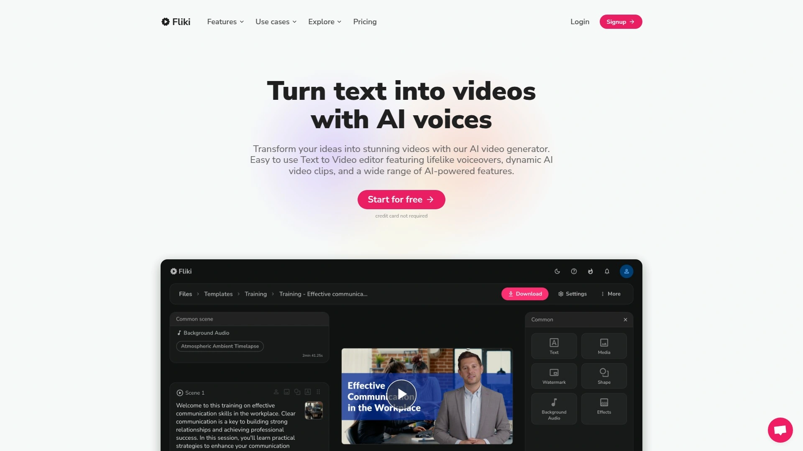

Fliki把文字转视频的流程简化到极致。输入脚本或甚至只是一个想法,选择2000多种AI语音中的一个,AI会自动匹配场景、添加媒体素材、生成视频。支持80多种语言,可以保持视觉一致性,还能克隆你自己的声音。特别适合快速制作TikTok、YouTube、培训或营销内容。

Fliki的AI角色一致性功能能确保同一个角色在不同场景中保持外观统一,对于连续剧情的视频特别有用。平台提供数百万优质媒体素材,AI会根据脚本内容智能选择最合适的视觉元素。支持自定义AI数字人作为主持人,带同步唇形和多种屏幕位置。视频可以导出为MP4和MOV格式,音频可以导出为MP3和WAV,兼容所有主流平台。有字符数量限制,单次最多15000字符。

## **[Colossyan](https://www.colossyan.com)**

把PPT和PDF直接转成视频,150个真人AI数字人随意挑。

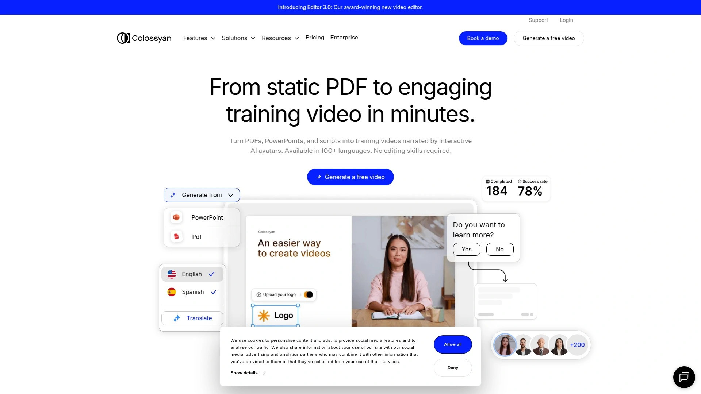

Colossyan最大的特色是能直接上传文档、PPT或粘贴文字,然后自动转化成带真人数字人讲解的完整视频。不需要手动编辑每一帧,整个过程不到5分钟。提供150多个逼真的AI数字人和语音风格,从正式的叙述者到友好的主持人,你可以选择最符合内容调性的形象。

更厉害的是Colossyan能创建你的专属AI数字人并克隆你的声音,这对品牌一致性特别有用。你的数字分身可以一直帮你拍视频,省去真人出镜的时间。支持70多种语言的自动翻译和配音,让内容触达全球受众。你还能按服装风格和地区口音筛选主持人,让视觉更贴合目标文化或专业场景。Colossyan特别适合教育工作者、企业培训师和营销团队,能快速把文档资料变成吸引人的视频内容。

## **[InVideo AI](https://invideo.io)**

OpenAI GPT-4驱动的全流程视频生成器,用对话方式编辑视频。

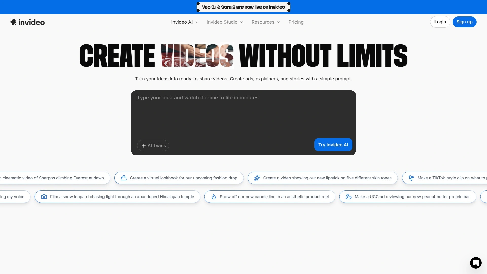

InVideo AI把OpenAI的GPT-4、图像生成API和文字转语音模型整合在一起,变成一个完整的视频制作团队。你只需要输入创意,AI会处理脚本、媒体素材、配音、字幕,几分钟内生成完整视频。不管是TikTok广告、产品演示还是解说视频,用自然语言描述需求就能快速创作。

特别独特的是它的对话式编辑功能。不需要学习复杂的时间轴剪辑软件,直接用文字命令告诉AI你要改什么——"换个背景音乐""调整语气""替换这个场景",AI就会执行。支持50多种语言,可以创建完整的AI电影和纪录片。还能创建你的AI分身用于培训视频、产品讲解,或者只克隆声音来制作无脸视频。甚至能生成超逼真的UGC视频,包括产品评测、自拍风格内容,不需要真人出镜。

## **[JoggAI](https://www.jogg.ai)**

450个超逼真AI数字人,10分钟完成原本需要50小时的视频。

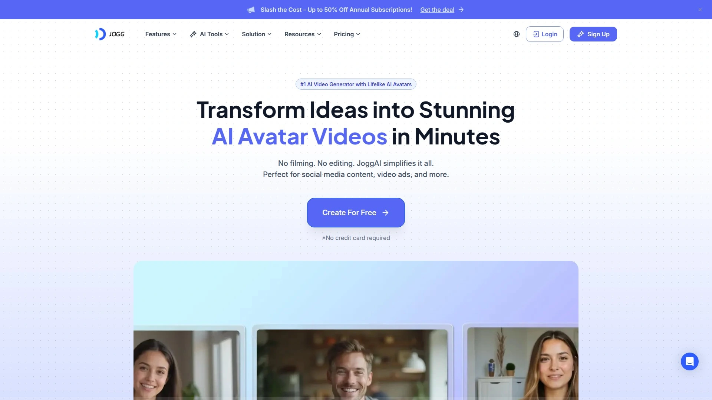

JoggAI专注于快速高质量的视频生成,宣称能把传统方式需要50多小时、1000多美元成本、3人以上团队才能完成的视频,缩短到10分钟、15美元、1个人就能搞定,而且质量从业余提升到专业级别。提供450多个超逼真的AI数字人,可以添加到社交媒体内容、视频广告等各种场景。

平台支持多种创作方式:数字人视频、照片说话、创意转视频、播客视频、视频翻译等。你可以从现有内容甚至"空气"中生成专业视频,跳过复杂的剪辑流程。提供文字生成数字人、照片生成数字人、自定义数字人和数字人画廊等多种选择,创建的数字人看起来自然,能有效传达信息并吸引观众。JoggAI特别适合需要批量制作内容的社交媒体运营者和广告主。

## **[Creatify AI](https://creatify.ai)**

专为广告优化的AI数字人视频生成器,1000种以上数字人形象。

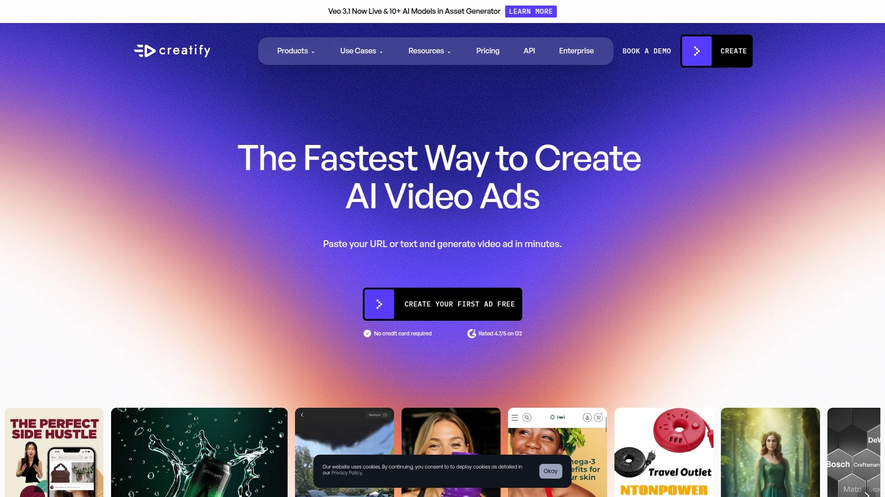

Creatify AI定位于广告和营销场景,提供1000多种AI数字人形象专门用于制作广告视频。平台简化了广告创作流程,让你几分钟内就能产出可以直接投放的视频广告素材。不需要雇佣演员或模特,AI数字人可以展示产品、讲解卖点、与观众互动。

Creatify特别适合电商卖家、品牌营销团队和广告投手。你可以快速测试不同的数字人、文案、风格,找到最有效的广告组合。平台承诺创建数字人只需几秒钟,大幅缩短了从创意到投放的时间。对于需要持续产出广告素材、不断测试优化的团队来说,Creatify能显著提升效率和降低成本。

## **[VEED.IO](https://www.veed.io)**

浏览器里的AI视频工具,文字转视频无需下载软件。

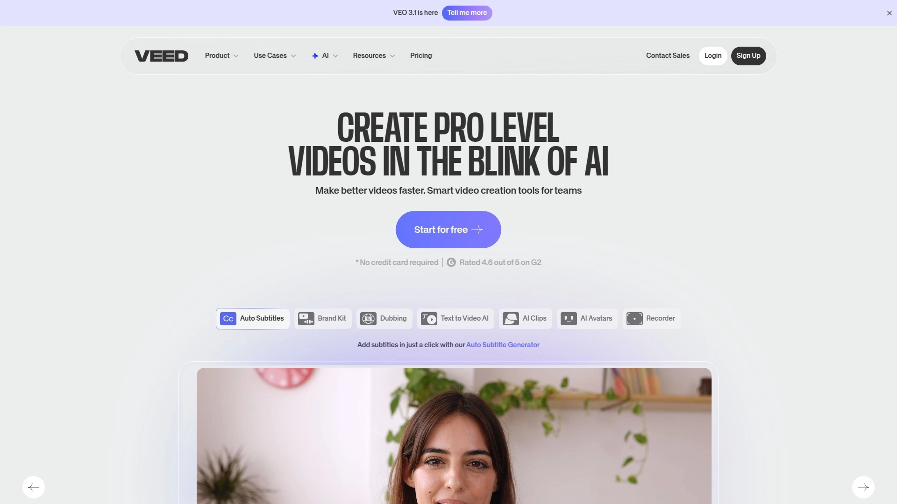

VEED.IO的优势是完全基于浏览器,不需要下载任何软件就能创建AI视频。它的文字转视频功能通过组合影像素材、旁白和字幕来实现。你可以自定义格式、选择数字人形象和声音、编辑脚本,还能使用内置的脚本生成器来帮你写内容。

VEED提供一整套视频编辑工具,不只是生成,还能裁剪、添加特效、调整音频等。对于需要轻度编辑功能、不想安装专业软件的用户来说,VEED是个便捷的选择。它的界面友好,新手也能快速上手,适合个人创作者和小团队快速产出视频内容。

## **[Runway ML](https://runwayml.com)**

好莱坞级别的AI视频生成器,文字和图片都能变电影级画面。

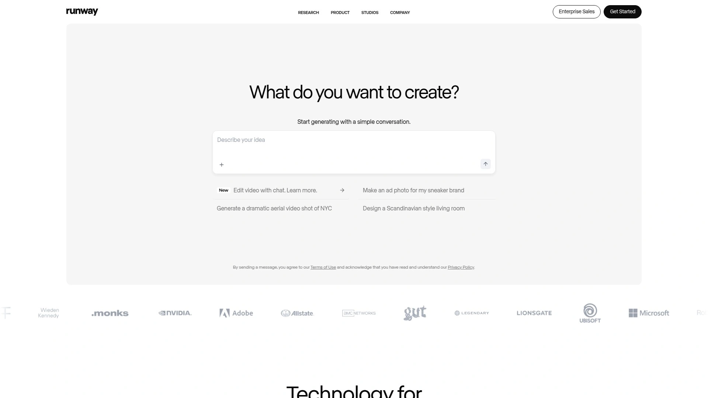

Runway ML是专业创意人士最爱的AI视频工具之一,以生成电影级画质著称。它的Gen-4模型能实现超现实主义、电影感和精细的物理效果,动态镜头运动、自然视差效果都非常出色。既支持文字生成视频,也支持图片转视频,还能对现有视频进行AI风格转换和增强。

Runway特别适合高端广告、电影预可视化、现实感故事讲述等对视觉质量要求极高的场景。虽然渲染速度相对慢一些,但输出质量能达到专业制作水准。它提供多种AI工具,包括视频编辑、图像生成、3D纹理、动作捕捉等,是个综合性的AI创意平台。对于追求艺术表现力和视觉冲击力的创作者来说,Runway是首选工具。

## **[Adobe Firefly](https://www.adobe.com)**

Adobe出品的AI视频生成器,无缝对接Creative Cloud生态。

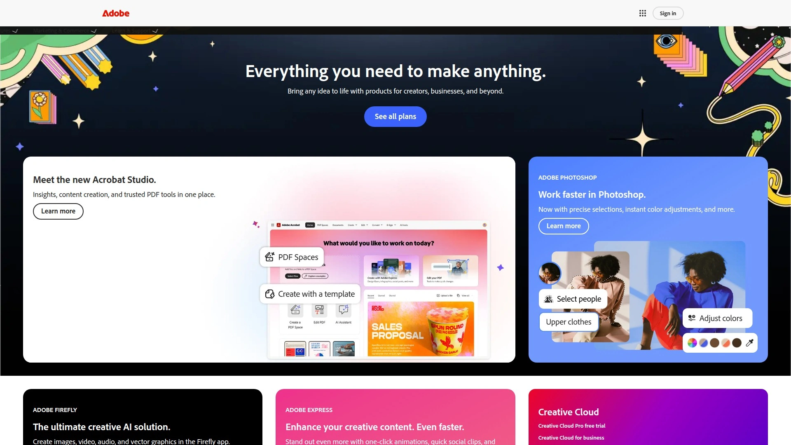

Adobe Firefly是Adobe推出的AI创意工具套件的一部分,能从文字或图片生成高质量视频。它最大的优势是跟Adobe Creative Cloud的其他工具深度集成,生成的视频可以直接导入Premiere Pro或After Effects做进一步编辑。对于已经在使用Adobe全家桶的设计师和视频制作者来说,Firefly是个自然的选择。

Firefly不仅能生成视频,还能创建AI数字人。它的文字转数字人功能可以快速生成工作室级别的视频,数字人形象吸引人且逼真。整个过程快速、简单、安全。虽然单独使用Firefly的功能可能不如专业AI视频平台全面,但它在Adobe生态系统中的位置让它成为专业创意工作流程中的有力补充。

***

## 常见问题

**这些AI视频生成工具适合什么人使用?**

营销人员可以快速制作广告和宣传视频,教育工作者能把课程内容转化成视频教学,企业培训师可以批量生成多语言培训教程,电商卖家能让AI模特展示产品。只要你需要视频内容但又不想花大价钱雇摄制团队,这些工具都能帮到你。从个人创作者到大型企业都有合适的选择。

**生成的AI数字人视频看起来会不会很假?**

头部平台像HeyGen、Synthesia、KreadoAI的数字人技术已经非常成熟,唇形同步精准,面部表情自然,很难一眼看出是AI生成的。尤其是用真人照片训练出来的专属数字人,相似度可以达到99%以上。当然不同平台的技术水平有差异,建议先用免费版测试看看效果是否满足需求。

**免费版够用吗,什么时候需要升级付费?**

大部分平台提供免费版本或试用,比如KreadoAI的免费计划有3分钟视频额度,HeyGen每月可创建3个视频。如果只是偶尔做几个视频,免费版完全够用。但当你需要更多数字人选择、更长视频时长、去除水印、商用授权、多语言批量生成时,就得升级付费版。付费计划通常从每月20到50美元不等,比传统视频制作成本低得多。

***

## 总结

如果你需要一个功能全面、数字人库最丰富、支持140种语言的AI视频生成器,[KreadoAI](https://www.kreadoai.com)是理想选择——1000多个真人AI数字人和40000种AI语音让你的内容覆盖全球受众,从文字、图片、PPT到网址都能一键转视频,特别适合需要快速产出多语言营销内容和教学视频的企业和创作者。这12个平台各有侧重,追求最逼真效果选HeyGen,企业级应用找Synthesia,照片转视频用D-ID,快速广告制作找Creatify,电影级画质选Runway ML。找对工具,视频制作从几万块几周时间,变成几十块几分钟搞定。

[37](https://en.wikipedia.org/wiki/Synthesia_(company))
